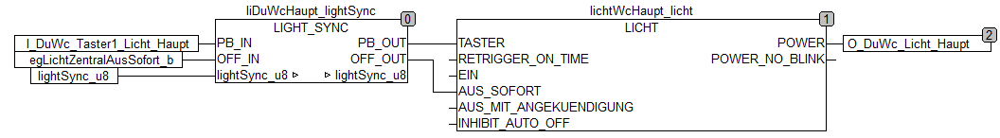
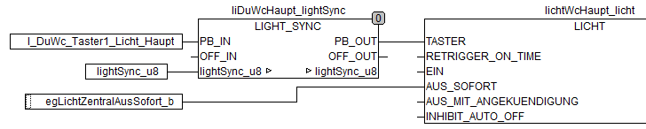
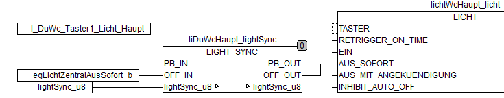

LIGHT_SYNC
==========

The Function Block allows synchronized switch off of lights in a room, floor and whole building from any
light button in a building in case lights are switched by a Wago 750-8xx PLC using my light control block "LICHT" or any other light function block which has an input for a toggle switch plus a dedicated input for switching off the light

Functionality
-------------
A light push button usually toggles one light by single clicks, this basic functionality is not touched by the LIGHT_SYNC function block. 
The added functionality can be reached by pressing the pushbutton longer. In this case it will switch off all lights of the room including the light assigned to the button. If pressed even longer, the lights of the whole floor and as a last step all lights in the building will go off.

There are parameters which change behavior:

  * One which excludes the light which is assigned to the button from switching off (SELF_OFF = FALSE)
  * One which disables the added functionality for the button assigned to the light, but the light can still be
    controlled through the other light's buttons (PASSIVE = TRUE)

Setup in Codesys
----------------
Three steps are required to make the function block working:

 1. Add LIGHT_SYNC blocks and put them in front of the LICHT function block. The blocks have to be looped into the signals which are connected to the inputs TASTER and AUS_SOFORT (or alternatively AUS_MIT_ANKUENDIGUNG) of the LICHT function block. If there is nothing connected to AUS_\* , the input OFF_IN might be left without any connection, but the OFF_OUT must still be connected with AUS_\*. Just like that:

 2. Create a new variable of type BYTE and connect it to lightSync_u8 IN_OUT pin of all LIGHT_SYNC blocks. It is used for interaction between the instances of the block. 
In case the PLC controls the lights of separated apartments you don't want to have interaction between the lights of different apartment (no global house lights off) just use a dedicated BYTE variable for each apartment.
Please note that in case the blocks which need interaction are located in different programs, the BYTE variable has to be declared in the global variables area.

 3. Configure the assignment of each LIGHT_SYNC block to rooms and floors. This is done through      IDs (between 1 and 254) written into the parameters ID_ROOM and ID_FLOOR. Each room and     each floor gets its own ID which must be absolutely unique (no overlap between floor and room IDs and no for room IDs on different floors). 

Example for ID assignment: 

* 1st floor `ID_FLOOR = 1`
* 2nd Floor `ID_FLOOR = 2`
* Ground Floor`ID_FLOOR = 3`
* 1st floor bath `ID_ROOM = 11`
* 1st floor living room `ID_ROOM = 12`
* 2nd floor bath `ID_ROOM = 21`
* 2nd sleeping room `ID_ROOM = 22`

Inputs
------
*	PB_IN : BOOL; (* Input for the pushbutton which shall toggle the light *)
*	OFF_IN: BOOL; (* Input for the any logic which shall switch off the light. Can be left without any connection if there is not such logic *)

Outputs
-------
*	PB_OUT : BOOL := FALSE; (* Output to the pushbutton input of the LICHT function block. In case of PASSIVE = TRUE this is a modified routing through of PB_IN, otherwise PB_OUT
	will just go to TRUE for one cycle in case of a short pushbutton press and in case of a long press it will remain FALSE *)
*	OFF_OUT : BOOL := FALSE; (* The disjuction (=OR) of the OFF_IN signal and a request to switch off the light from a pushbutton connected locally or connected to other LIGHT_SYNC
	function blocks *)

In-/Output
----------
* lightSync_u8 : BYTE; (* externally variable of type BYTE which is connected to all LIGHT_SYNC blocks. It is used for communication between the instances of the block *)

Parameters
----------
* ID_ROOM : BYTE := 0; (* unique number for room between 1 and 254 in normal case, but not same number as any ID_FLOOR or ID_ALL. Set to 0  if no room request shall be sent' *)
* ID_FLOOR : BYTE := 0; (* unique number for floor between 1 and 254 in normal case, but not same number as any ID_ROOM or ID_ALL. Set to 0 if no floor request shall be sent *)
* ID_ALL : BYTE := 255; (* unique number for overall group which usually cover all lights. Change only to have multiple 'ALL' groups, but do not use same number as any ID_ROOM or ID_FLOOR *)
* T_ROOM : TIME := t#500ms; (* duration of button press to switch off light of whole room *)
* T_FLOOR : TIME := t#2000ms; (* duration of button press to switch off light of whole floor. Must be higher than T_ROOM *)
* T_ALL : TIME := t#4000ms;  (* duration of button press to switch off all lights Must be higher than T_FLOOR *)
* SELF_OFF : BOOL := TRUE; (* Set to FALSE if long press of the pushbutton connected  to this block should not switch off the light connected to this block but only the others in the room / floor / building. In case the switch off request comes from another LIGHT_SYNC block the light is still switched off *)

Variants of Usage
-----------------
If the light connected to the LIGHT_SYNC block should not be switched off through the block at all (also through the other blocks in difference to just setting parameter SELF_OFF = FALSE) just do not connect OFF_OUT to the light block (leave OFF_OUT unconnected). Any other logic that should switch off the light must be connected directly to the related input of the the light functionblock.

If the block shall act passively only (receive switch off requests and react on it by switching off the connected light but do not send requests to others) just leave PB_IN and PB_OUT without connection and connect the pushbutton to the light function block directly.

 

Changelog
---------
* 17.3.2019 ver 1.5: handle IDs set to 0
* 16.3.2019 ver 1.4: made ID_ALL configurable
* 10.2.2019 ver 1.3: Collision avoidance: Write request to lightSync_u8 in a later cycle in case there is a  request from another instance running
* 4.2.2019 ver 1.2: removed PASSIVE parameter as the functionality can be reached by not using PB_IN and PB_OUT
* 24.1.2019 ver 1.1: PASSIVE parameter handling implemented 
* 10.1.2019 ver 1.0: initial tested version

LIGHT_SYNC_INJ
==============
This function triggers switch off lights connected to LIGH_SYNC blocks through any signal's rising edge.

Functionality
-------------
At rising edge on the Input IN the function block triggers switches off all or a group of lights which are connected to a LIGHT_SYNC function block. The request it communicated to the LIGHT_SYNC blocks through the common in-/output variable connected to light_sync_u8

Setup in Codesys
----------------
Add a LIGHT_SYNC_INJ block to any program in the project where the variable connected to LIGHT_SYNC block's in-/output lightSync_u8 is visible (anywhere in case this variable is defined globally). Connect that variable to same named in-/output of LIGHT_SYNC_INJ block. Connect the input signal which shall trigger the switch off request to the input OFF. 
If not all lights should be switched, change GROUP_ID to select which group of lights shall be switched off, e.g. if it shall switch all lights of the ground floor, set GROUP_ID to the number which is set in the related LIGHT_SYNC block's ID_FLOOR parameter

Inputs
------
* OFF : BOOL; (* Trigger to inject the request at rising edge. The request will be stored placed at next possibity if other requests are running (lightSync_u8 > 0). *)

Outputs
-------
 - none

In-/Output
----------
* lightSync_u8 : BYTE; (* externally variable of type BYTE which is connected to all LIGHT_SYNC blocks. It is used for communication between the instances of the block *)

Parameters
----------
* GROUP_ID : BYTE := 255; (* ID of the group to switch (ID configured as ID_ROOM or ID_FLOOR in LIGHT_SYNC FB), keep unchanged (=255) in case all lights should be adressed'*)

Changelog
---------
* 14.3.2019 ver 1.0: Initial implementation

**Author:** MacPiper

